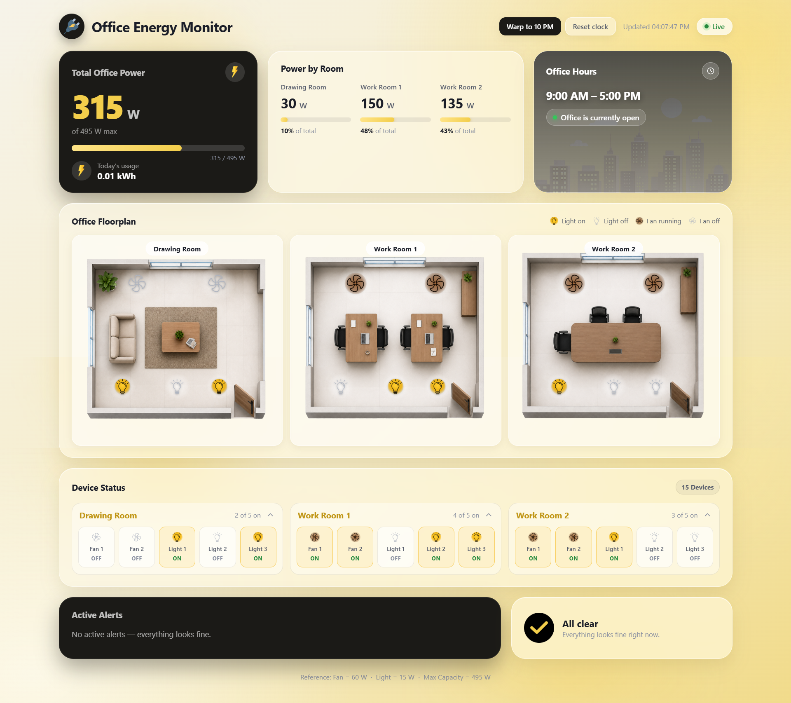
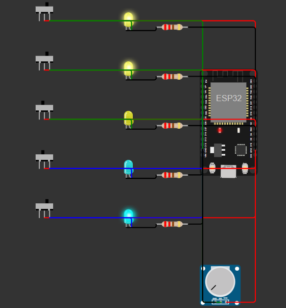

# Office Energy Monitor — "Lights, Fans, Discord"

Monitor a small office's lights and fans through a **live web dashboard** and a **Discord bot**, both backed by a **single shared backend** that is the one source of truth for device state. Built for the Techathon Nationals & Rover Summit preliminary round.



> **Live dashboard:** https://techathon-dash.vercel.app — real-time power, per-room breakdown, top-view floorplan (lights glow, fans spin), device status and alerts.


_Editable source: [draw.io file](https://drive.google.com/file/d/1Zz894QOD175mB1b6Pxd9l28LW-5Kj_r9/view?usp=sharing)_

## Highlights

- **One backend, one source of truth.** A Node/TS process simulates 15 devices, tracks energy use, raises alerts, serves REST, and broadcasts every change over Socket.IO. The dashboard and bot only ever read from it.
- **Real-time dashboard (no refresh).** Live device panel, power meter with per-room breakdown, timestamped alerts (devices on after hours, or a room left fully on > 2 h), and a top-view **floorplan where lights glow and fans spin**.
- **Discord bot on real data.** `!status`, `!room`, `!usage` answered from the live backend, humanized by an optional LLM (with a template fallback), plus proactive after-hours alert posts.
- **Time-aware simulation.** Devices churn during office hours (9 AM–5 PM) and **freeze after hours**, with alerts flagging anything left on. Demo controls let you replay office hours, warp to 10 PM, or reset to real time on demand.

## Live deployment

| Piece         | Host              | URL                                                                                    |
| ------------- | ----------------- | -------------------------------------------------------------------------------------- |
| Web dashboard | Vercel            | **https://techathon-dash.vercel.app**                                                  |
| Backend API   | Azure App Service | https://office-energy-monitor-auvro-b2gyh6g4f9h6f5bg.centralindia-01.azurewebsites.net |
| Discord bot   | Azure App Service | **Join & try it:** https://discord.gg/7YDYzM5Bb (headless; also serves a health endpoint) |

All three read from the **one** backend, so the dashboard and the bot always agree.

**Try the bot:** join the [Discord server](https://discord.gg/7YDYzM5Bb) and type — replies come from the same live backend the dashboard uses:

```
!status                      # whole-office summary, all 3 rooms
!room work1                  # one room (aliases: drawing / work1 / work2)
!usage                       # current watts + today's kWh
!help                        # list commands
```

Tip: click **Warp to 10 PM** on the dashboard to make the bot post a proactive after-hours alert.

**How it's wired**

- **Backend** and **bot** are each bundled with [esbuild](https://esbuild.dev) (`npm run build`) into a single self-contained file, then run on **Azure App Service** (Linux, Node 22) — startup commands `node backend/dist/server.js` and `node bot/dist/index.js`. The bot has no web UI, so it also serves a tiny HTTP health endpoint on Azure's port to stay "healthy" and avoid restart loops. Both share one App Service Plan and auto-deploy from `main` via **GitHub Actions**.
- **Dashboard** deploys to **Vercel** from the repo root ([`vercel.json`](vercel.json)); its `VITE_BACKEND_URL` build var points at the Azure backend (Socket.IO + REST are same-origin locally via the Vite proxy, cross-origin in prod — CORS is open on the backend).
- **Secrets** (Discord token, Groq / OpenAI keys) live only as host env vars / Azure **App Settings** — never committed. `.env` files stay local and git-ignored.

## Demo controls (for reviewers)

The dashboard has three buttons (top bar) so you can drive the simulation on demand — no need to wait for the real clock:

| Button | What it does |
| --- | --- |
| **▶ Run demo** | Replays a normal **9 AM–5 PM office**: devices toggle on/off **live** (no alerts). Runs for 3 minutes with a countdown, then auto-resets. _Shown only when it's currently after hours._ |
| **Warp to 10 PM** | Jumps to after-hours — the office **freezes** and the **Active Alerts** panel flags anything left on (and the Discord bot posts a proactive nudge). |
| **Reset clock** | Returns to the real current time; alerts then follow the real hour. |

> **⚠️ If the dashboard looks "still", that's by design.** After 5 PM the office is **intentionally frozen** — in real life nobody is in the office to switch lights or fans on or off, so devices hold their last state. That's exactly what makes *"left on after hours"* an anomaly worth flagging. So if you open the live dashboard in the evening and nothing is toggling, it is **not broken**.
>
> **To see the real-time toggling, click ▶ Run demo.** It replays the busy office-hours behaviour, so you can watch devices flip on/off live and the power meter + floorplan update in real time — exactly the real-time behaviour being evaluated. Then **Warp to 10 PM** to see the alerts (and the bot post) fire on cue.

## The office (fixed)

3 rooms — Drawing Room, Work Room 1, Work Room 2. Each room has **2 fans + 3 lights = 5 devices**, so **15 devices total** (6 fans + 9 lights). Reference wattages: fan = 60 W, light = 15 W. Office hours: 9 AM–5 PM.

## Architecture

```
[Simulated Device Layer] → [Backend API] → [ Web Dashboard ] && [ Discord Bot ]
```

The simulator and device state live **only in the backend**. See the full picture in the [system diagram](./GithubImages/SystemDiagram.drawio.png).

- **Backend** — Node.js + TypeScript, Express (REST) + Socket.IO. In-memory simulator, alerts engine, usage accumulator.
- **Dashboard** — React + Vite + TypeScript, live over Socket.IO.
- **Bot** — discord.js; humanizes replies via **OpenAI → Groq**, falling back to deterministic templates when no key is set or a provider fails.
- **Shared** — one `@office/shared` package of types + constants imported by all three, so nothing drifts.

## Repository layout

```
shared/      # @office/shared — Device/Alert types, room + wattage constants, socket event names
backend/     # Express + Socket.IO + simulator + alerts + usage accumulator
dashboard/   # React + Vite dashboard (floorplan, power meter, alerts, device panel)
bot/         # discord.js bot (!status/!room/!usage, proactive alerts, LLM humanizer)
docs/        # HARDWARE.md + wokwi/ (runnable ESP32 circuit: diagram.json, sketch.ino)
GithubImages/# system diagram (draw.io export) embedded in this README
prd.md       # product requirements / build spec
```

## Quick start

Requires **Node.js 20+**. From the repo root:

```bash
npm install
```

Run the two services in separate terminals:

```bash
npm run dev -w @office/backend      # http://localhost:4000  (REST + Socket.IO + simulator)
npm run dev -w @office/dashboard    # http://localhost:5173  (proxies /api + socket to backend)
```

Open **http://localhost:5173**. During office hours devices toggle live; after 5 PM the office freezes and flags anything left on. Drive it with the demo buttons — **Run demo** (office-hours simulation, shown after hours), **Warp to 10 PM**, and **Reset clock**.

### Discord bot (optional — needs a token)

```bash
cp bot/.env.example bot/.env        # then fill in the values below
npm run dev -w @office/bot
```

You can also exercise the bot's commands without Discord, straight against the backend:

```bash
npm run cli -w @office/bot -- status
npm run cli -w @office/bot -- room work1
npm run cli -w @office/bot -- usage
```

## Configuration

Backend (`backend/.env`, optional):

| Var           | Default | Purpose                       |
| ------------- | ------- | ----------------------------- |
| `PORT`        | `4000`  | HTTP/Socket.IO port           |
| `SIM_TICK_MS` | `8000`  | Simulation tick interval, ms (office-hours toggling cadence) |

Bot (`bot/.env`):

| Var                        | Default                 | Purpose                                                                                              |
| -------------------------- | ----------------------- | ---------------------------------------------------------------------------------------------------- |
| `DISCORD_TOKEN`            | —                       | **Required** to connect. Also enable the **Message Content** intent in the Discord Developer Portal. |
| `DISCORD_ALERT_CHANNEL_ID` | —                       | Channel for proactive alert posts                                                                    |
| `BACKEND_URL`              | `http://localhost:4000` | Where the shared backend lives (use the hosted URL in prod)                                          |
| `OPENAI_API_KEY`           | —                       | Enables OpenAI (tried first). Omit to skip.                                                          |
| `OPENAI_MODEL`             | `gpt-4o-mini`           | OpenAI model override                                                                                |
| `GROQ_API_KEY`             | —                       | Enables Groq (fallback if OpenAI fails). Omit to skip.                                               |
| `GROQ_MODEL`               | `llama-3.1-8b-instant`  | Groq model override                                                                                  |

**LLM humanizer.** The bot rewrites the computed facts into a warm, human sentence. It tries **OpenAI first** ([platform.openai.com](https://platform.openai.com/api-keys)), then falls back to **Groq** ([console.groq.com](https://console.groq.com) — free) if OpenAI is missing/rate-limited, then to **built-in templates** if neither key is set. So the bot always replies with correct data — the LLM only changes the phrasing, never the numbers. A hardened system prompt keeps it from inventing rooms, devices or values that aren't in the data.

`.env` files are git-ignored; only the `.env.example` templates are committed. In production these values are set as **Azure App Settings** on the bot's App Service, not in a file.

## Backend API

| Endpoint / event        | Purpose                                                 |
| ----------------------- | ------------------------------------------------------- |
| `GET /api/state`        | All 15 devices + total W + per-room + today's kWh       |
| `GET /api/room/:room`   | One room (`drawing` / `work1` / `work2`); 404 otherwise |
| `GET /api/usage`        | Current total W + today's estimated kWh                 |
| `GET /api/alerts`       | Active alerts                                           |
| `POST /api/sim/settime` | Demo: `{ "hour": 0-23 }` warps the clock (10 PM → frozen + alerts) |
| `POST /api/sim/demo`    | Demo: simulate office hours (toggling, no alerts) for 3 min, then auto-reset |
| `POST /api/sim/reset`   | Demo: return to real time                              |
| socket `state:update`   | Full snapshot (devices + alerts) pushed every tick     |
| socket `alert:new`      | Pushed when an alert is raised                          |

## Scripts

Run from the repo root (npm workspaces):

```bash
npm test         # unit tests (backend + bot)
npm run typecheck
npm run lint
npm run format   # prettier --write
```

## Hardware / schematic

A **runnable Wokwi circuit** models one representative room (Work Room 1: 3 lights + 2 fans): an ESP32 senses each device's on/off state and the room's aggregate current, then prints a JSON snapshot in the backend's `Device` shape — the "device layer → backend" edge of the system diagram.

- ▶️ **Live simulation:** https://wokwi.com/projects/468606509313864705
- 📁 **Project files:** [`docs/wokwi/`](./docs/wokwi/) — [`diagram.json`](./docs/wokwi/diagram.json) (circuit), [`sketch.ino`](./docs/wokwi/sketch.ino) (firmware), [`README`](./docs/wokwi/README.md) (BOM, pin map, wiring, electrical reasoning)
- 📐 **Design & reasoning:** [`docs/HARDWARE.md`](./docs/HARDWARE.md)



Pins: lights → GPIO 25/26/27, fans → GPIO 32/33 (all `INPUT_PULLDOWN`), room current → GPIO 34 (ADC). No physical hardware is needed — it runs entirely in simulation.

## Reference docs

- [`prd.md`](./prd.md) — full product requirements / build plan
- [Problem statement (v1.2)](./Hackathon%20Problem%20Statement%20%28Preliminary%20Round%29%20v1.2.md)
