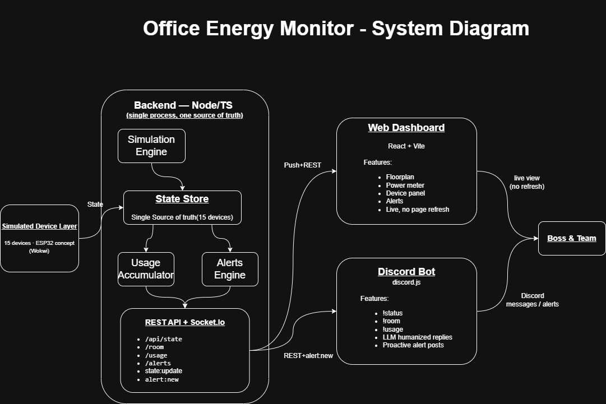

# Office Energy Monitor — "Lights, Fans, Discord"

Monitor a small office's lights and fans through a **live web dashboard** and a **Discord bot**, both backed by a **single shared backend** that is the one source of truth for device state. Built for the Techathon Nationals & Rover Summit preliminary round.



_Editable source: [draw.io file](https://drive.google.com/file/d/1Zz894QOD175mB1b6Pxd9l28LW-5Kj_r9/view?usp=sharing)_

## Highlights

- **One backend, one source of truth.** A Node/TS process simulates 15 devices, tracks energy use, raises alerts, serves REST, and broadcasts every change over Socket.IO. The dashboard and bot only ever read from it.
- **Real-time dashboard (no refresh).** Live device panel, power meter with per-room breakdown, timestamped alerts, and a top-view **floorplan where lights glow and fans spin**.
- **Discord bot on real data.** `!status`, `!room`, `!usage` answered from the live backend, humanized by an optional LLM (with a template fallback), plus proactive after-hours alert posts.
- **Demo mode.** Warp the simulated clock to 10 PM to trigger the after-hours alert on cue.

## The office (fixed)

3 rooms — Drawing Room, Work Room 1, Work Room 2. Each room has **2 fans + 3 lights = 5 devices**, so **15 devices total** (6 fans + 9 lights). Reference wattages: fan = 60 W, light = 15 W. Office hours: 9 AM–5 PM.

## Architecture

```
[Simulated Device Layer] → [Backend API] → [ Web Dashboard ] && [ Discord Bot ]
```

The simulator and device state live **only in the backend**. See the full picture in the [system diagram](./GithubImages/SystemDiagram.drawio.png).

- **Backend** — Node.js + TypeScript, Express (REST) + Socket.IO. In-memory simulator, alerts engine, usage accumulator.
- **Dashboard** — React + Vite + TypeScript, live over Socket.IO.
- **Bot** — discord.js; optional Groq/Gemini LLM for friendly phrasing, template fallback otherwise.
- **Shared** — one `@office/shared` package of types + constants imported by all three, so nothing drifts.

## Repository layout

```
shared/      # @office/shared — Device/Alert types, room + wattage constants, socket event names
backend/     # Express + Socket.IO + simulator + alerts + usage accumulator
dashboard/   # React + Vite dashboard (floorplan, power meter, alerts, device panel)
bot/         # discord.js bot (!status/!room/!usage, proactive alerts, LLM humanizer)
docs/        # system-diagram.svg, HARDWARE.md (+ Wokwi schematic screenshot)
prd.md       # product requirements / build spec
```

## Quick start

Requires **Node.js 20+**. From the repo root:

```bash
npm install
```

Run the two services in separate terminals:

```bash
npm run dev -w @office/backend      # http://localhost:4000  (REST + Socket.IO + simulator)
npm run dev -w @office/dashboard    # http://localhost:5173  (proxies /api + socket to backend)
```

Open **http://localhost:5173**. Devices flicker live; click **Warp to 10 PM** to trigger an after-hours alert.

### Discord bot (optional — needs a token)

```bash
cp bot/.env.example bot/.env        # then fill in the values below
npm run dev -w @office/bot
```

You can also exercise the bot's commands without Discord, straight against the backend:

```bash
npm run cli -w @office/bot -- status
npm run cli -w @office/bot -- room work1
npm run cli -w @office/bot -- usage
```

## Configuration

Backend (`backend/.env`, optional):

| Var | Default | Purpose |
|---|---|---|
| `PORT` | `4000` | HTTP/Socket.IO port |
| `SIM_TICK_MS` | `2500` | Simulation tick interval (ms) |

Bot (`bot/.env`):

| Var | Default | Purpose |
|---|---|---|
| `DISCORD_TOKEN` | — | **Required** to connect. Also enable the **Message Content** intent in the Discord Developer Portal. |
| `DISCORD_ALERT_CHANNEL_ID` | — | Channel for proactive alert posts |
| `BACKEND_URL` | `http://localhost:4000` | Where the shared backend lives (use the hosted URL in prod) |
| `GROQ_API_KEY` | — | Enables Groq (tried first). Omit to skip. |
| `GROQ_MODEL` | `llama-3.1-8b-instant` | Groq model override |
| `OPENAI_API_KEY` | — | Enables OpenAI (fallback if Groq fails). Omit to skip. |
| `OPENAI_MODEL` | `gpt-4o-mini` | OpenAI model override |

The humanizer tries **Groq → OpenAI → built-in templates**, so the bot always replies with correct data even with no keys set.

`.env` files are git-ignored; only the `.env.example` templates are committed.

## Backend API

| Endpoint / event | Purpose |
|---|---|
| `GET /api/state` | All 15 devices + total W + per-room + today's kWh |
| `GET /api/room/:room` | One room (`drawing` / `work1` / `work2`); 404 otherwise |
| `GET /api/usage` | Current total W + today's estimated kWh |
| `GET /api/alerts` | Active alerts |
| `POST /api/sim/settime` | Demo mode: `{ "hour": 0-23 }` warps the simulated clock |
| `POST /api/sim/reset` | Demo mode: return to real time |
| socket `state:update` | Full snapshot pushed every tick |
| socket `alert:new` | Pushed when an alert is raised |

## Scripts

Run from the repo root (npm workspaces):

```bash
npm test         # unit tests (backend + bot)
npm run typecheck
npm run lint
npm run format   # prettier --write
```

## Hardware / schematic

The concept ESP32 circuit (pin mapping, electrical reasoning, Wokwi build steps) lives in [`docs/HARDWARE.md`](./docs/HARDWARE.md). No physical hardware is needed for the demo.

## Reference docs

- [`prd.md`](./prd.md) — full product requirements / build plan
- [Problem statement (v1.2)](./Hackathon%20Problem%20Statement%20%28Preliminary%20Round%29%20v1.2.md)
